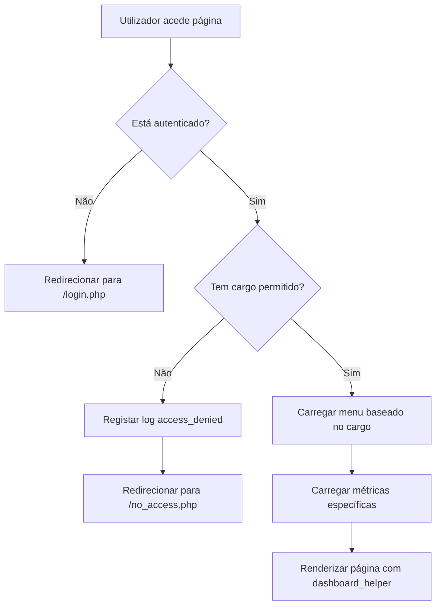

# 🔒 Sistema de Proteção de Rotas e Dashboard Dinâmico

## 📋 Visão Geral

O CyberCore agora possui um sistema completo de proteção de rotas baseado em cargos (roles), com:

- ✅ **Proteção de rotas por cargo** - Controle granular de acesso
- ✅ **Dashboard dinâmico por role** - Métricas e dados específicos para cada cargo
- ✅ **Sidebar inteligente** - Menu adapta-se automaticamente ao cargo do usuário

---

## 🎭 Cargos Disponíveis

### 1. **Cliente**
- Acesso aos próprios serviços, faturas e tickets
- Menu: Dashboard, Serviços, Domínios, Alojamento, Faturação, Suporte

### 2. **Suporte ao Cliente**
- Gestão de tickets e clientes
- Menu: Dashboard, Serviços, Suporte, Clientes, Tickets, Logs

### 3. **Suporte Técnica**
- Gestão de serviços técnicos e domínios
- Menu: Dashboard, Serviços, Domínios, Alojamento, Suporte, Gestão de Serviços, Logs

### 4. **Suporte Financeira**
- Gestão de faturas e pagamentos
- Menu: Dashboard, Faturação, Suporte, Pagamentos, Logs

### 5. **Gestor**
- Acesso completo a todas as funcionalidades
- Menu: Dashboard, Serviços, Domínios, Alojamento, Faturação, Suporte, Clientes, Pagamentos, Tickets, Relatórios, Equipa, Configurações, Logs

---

## 🛠️ Como Usar

### 1. Proteger uma Página

```php
<?php
define('DASHBOARD_LAYOUT', true);
require_once __DIR__ . '/inc/auth.php';
require_once __DIR__ . '/inc/dashboard_helper.php';

// Proteger rota - apenas Gestor e Suporte Financeira podem aceder
checkRole(['Gestor', 'Suporte Financeira']);

$user = currentUser();
$GLOBALS['currentUser'] = $user;

// ... resto do código da página ...
?>
```

### 2. Verificar Permissões Específicas

```php
<?php
// Verificar se o usuário tem permissão para gerir utilizadores
if (hasPermission('can_manage_users')) {
    // Mostrar botão de adicionar usuário
    echo '<button>Adicionar Utilizador</button>';
}

// Ou usar requirePermission para bloquear acesso
requirePermission('can_view_reports'); // Retorna 403 se não tiver permissão
?>
```

### 3. Adicionar Item ao Menu

Editar `inc/menu_config.php`:

```php
[
    'url' => '/minha-pagina.php',
    'label' => 'Minha Página',
    'icon' => 'star', // Nome do ícone (ver lista abaixo)
    'key' => 'minha-pagina',
    'roles' => ['Gestor', 'Cliente'] // Cargos que podem ver este item
]
```

### 4. Obter Estatísticas do Dashboard

```javascript
// Frontend - fazer request para API
fetch('/inc/get_dashboard_stats.php')
    .then(res => res.json())
    .then(data => {
        console.log('Role:', data.role);
        console.log('Métricas:', data.metrics);
        console.log('Atividade recente:', data.recent_activity);
    });
```

---

## 🎨 Ícones Disponíveis

Os seguintes ícones estão disponíveis em `getMenuIcon()`:

- `dashboard` - Grid de quadrados
- `package` - Caixa 3D (serviços)
- `globe` - Globo (domínios)
- `server` - Servidor (alojamento)
- `credit-card` - Cartão de crédito (faturação)
- `message-circle` - Balão de mensagem (suporte)
- `users` - Grupo de pessoas (clientes)
- `dollar-sign` - Símbolo $ (pagamentos)
- `message-square` - Quadrado de mensagem (tickets)
- `bar-chart` - Gráfico de barras (relatórios)
- `settings` - Engrenagem (configurações)
- `list` - Lista (logs)
- `upload` - Seta upload (atualizações)
- `logout` - Porta saída (sair)

---

## 📊 Métricas por Cargo

### Cliente
```json
{
    "total_services": 5,
    "active_services": 4,
    "unpaid_invoices": 2,
    "open_tickets": 1,
    "unpaid_amount": 150.00,
    "next_renewal_date": "2025-02-15",
    "next_renewal_days": 50
}
```

### Gestor
```json
{
    "total_clients": 150,
    "total_services": 450,
    "active_services": 420,
    "unpaid_invoices": 25,
    "open_tickets": 12,
    "monthly_revenue": 15000.00,
    "total_revenue": 250000.00,
    "pending_amount": 5000.00,
    "upcoming_renewals": 35
}
```

### Suporte ao Cliente
```json
{
    "total_clients": 150,
    "my_tickets": 8,
    "open_tickets": 12,
    "closed_tickets_today": 5,
    "pending_tickets": 4,
    "high_priority_tickets": 2
}
```

---

## 🔐 Permissões Disponíveis

Use `hasPermission('nome_permissao')` para verificar:

### Cliente
- `can_view_own_services`
- `can_view_own_invoices`
- `can_create_tickets`
- `can_view_own_tickets`
- `can_manage_profile`

### Suporte ao Cliente
- `can_view_all_clients`
- `can_view_all_tickets`
- `can_manage_tickets`
- (+ todas as permissões de Cliente)

### Suporte Técnica
- `can_manage_services`
- `can_manage_domains`
- `can_manage_hosting`
- (+ todas as permissões de Cliente)

### Suporte Financeira
- `can_view_all_invoices`
- `can_manage_invoices`
- `can_view_all_payments`
- `can_manage_payments`
- (+ todas as permissões de Cliente)

### Gestor
- `can_manage_users`
- `can_manage_team`
- `can_view_reports`
- `can_manage_settings`
- `can_view_logs`
- `is_super_admin`
- (+ TODAS as outras permissões)

---

## 🚨 Logging de Segurança

O sistema agora registra automaticamente:

### Acessos Negados
```sql
INSERT INTO logs (user_id, type, message, created_at) 
VALUES (
    123, 
    'access_denied', 
    'Tentativa de acesso negado a /admin/settings.php (role: Cliente, permitido: Gestor)',
    NOW()
);
```

### Acessos Não Autenticados
```log
[2025-12-26 15:30:45] Unauthorized access attempt to /admin/customers.php
```

---

## 📱 Página de Acesso Negado

A nova página `no_access.php` mostra:

- ✅ Cargo atual do usuário
- ✅ Cargos necessários para aceder à página
- ✅ Timestamp e IP da tentativa
- ✅ Links para Dashboard e Suporte
- ✅ Design moderno e responsivo

---

## 🔄 Fluxo de Autenticação



---

## 💡 Exemplos Práticos

### Exemplo 1: Página Apenas para Gestores

```php
<?php
define('DASHBOARD_LAYOUT', true);
require_once __DIR__ . '/inc/dashboard_helper.php';

checkRole(['Gestor']);
$user = currentUser();
$GLOBALS['currentUser'] = $user;

$content = '<div class="card">
    <h2>Painel de Administração</h2>
    <p>Esta página é visível apenas para Gestores.</p>
</div>';

echo renderDashboardLayout('Admin', 'Painel administrativo', $content, 'dashboard');
?>
```

### Exemplo 2: Botão Condicional por Permissão

```php
<div class="card">
    <h2>Utilizadores</h2>
    
    <?php if (hasPermission('can_manage_users')): ?>
        <button onclick="addUser()">Adicionar Utilizador</button>
    <?php endif; ?>
    
    <table>
        <!-- Lista de utilizadores -->
    </table>
</div>
```

### Exemplo 3: API Endpoint Protegido

```php
<?php
require_once __DIR__ . '/inc/auth.php';

header('Content-Type: application/json');

// Apenas Gestor e Suporte Financeira podem aceder
checkRole(['Gestor', 'Suporte Financeira']);

$user = currentUser();

// Retornar dados
echo json_encode([
    'success' => true,
    'data' => getFinancialReport($user)
]);
?>
```

---

## 🧪 Testar o Sistema

1. **Login como Cliente** → Ver menu limitado
2. **Login como Gestor** → Ver menu completo com secção Administração
3. **Tentar aceder a `/admin/settings.php` como Cliente** → Ver página de acesso negado
4. **Verificar logs** → Ver registros de tentativas de acesso

---

## 📚 Arquivos Importantes

| Arquivo | Descrição |
|---------|-----------|
| `inc/menu_config.php` | Configuração de menus e permissões por cargo |
| `inc/dashboard_helper.php` | Renderização do dashboard com sidebar dinâmica |
| `inc/get_dashboard_stats.php` | API de estatísticas por cargo |
| `inc/auth.php` | Funções de autenticação e checkRole() |
| `no_access.php` | Página de acesso negado melhorada |
| `assets/css/pages/dashboard-modern.css` | Estilos do dashboard (inclui .nav-divider) |

---

## 🎯 Próximos Passos

- [ ] Implementar sistema de notificações por cargo
- [ ] Criar dashboard widgets dinâmicos
- [ ] Adicionar gráficos específicos por cargo
- [ ] Sistema de permissões personalizadas por utilizador
- [ ] Auditoria completa de acessos (relatório de segurança)

---

**Desenvolvido por CyberCore Team** 🚀
